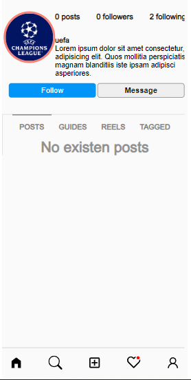

                                             INSTAGRAM 2023 PROYECT

Desarrollo del BackEnd con Javascript & TypeScript, manejo de sistema CRUD y modelado de la base de datos con prisma y PostgreSQL. Desarrollo del FrontEnd con Javascript, modelado y creación de componentes responsive en NEXT13.

-------------------------------------------------------------------------------------------------------------
Home app

-------------------------------------------------------------------------------------------------------------

Ruta Register, creas tu usario, el form esta totalmente controlado en backend y frontend.

-------------------------------------------------------------------------------------------------------------

Ruta Login, accedes a tu cuenta previamente registrada.

-------------------------------------------------------------------------------------------------------------

Ruta Profile, Accedes a tu perfil y ves tus posts y seguidores.

-------------------------------------------------------------------------------------------------------------

El clon de instagram cuenta con un modo oscuro, en todas sus rutas.

-------------------------------------------------------------------------------------------------------------

Ruta notificaciones, ves las notificaciones de tu cuenta.

-------------------------------------------------------------------------------------------------------------

Ruta create, Podes crear tu publicacion.

-------------------------------------------------------------------------------------------------------------

RESPONSIVE APP

Responsive Home

